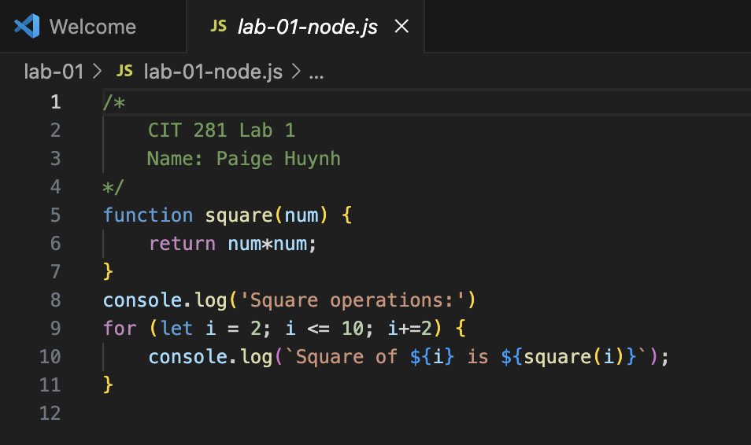
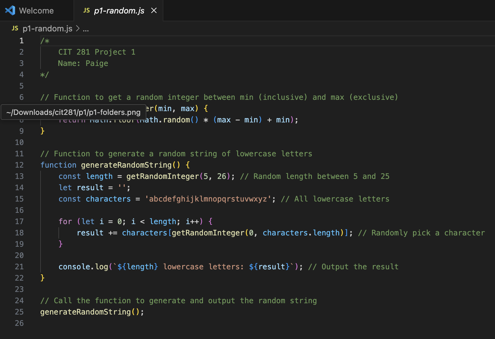

# CIT 281 Project 1

## Lab 1
Purpose: Prepare your personal computer by installing and setting up required software tools for the course, practice using these tools including terminal or shell commands and keyboard shortcuts, and create your first Node.js server-side JavaScript file.

Technologies: Node.js, Terminal/Shell, Visual Studio Code (VSCode), Command Line Interface (CLI)

Learned: How to install and configure essential software tools, use terminal commands and keyboard shortcuts effectively, and write and run a basic Node.js server-side JavaScript file.

## Project 1
Purpose: Gain foundational experience using the operating system’s command line interface (CLI) to create and manage folders, use networking commands like ping, and practice breaking command execution; develop skills in writing and running non-web server Node.js JavaScript code within Visual Studio Code (VSCode).

Technologies: Command Line Interface (CLI), Node.js, Visual Studio Code (VSCode), JavaScript

Learned: How to create and list folders using CLI commands, use the ping command and interrupt processes with keyboard breaks, write and execute JavaScript files with Node.js, and run and debug code in the VSCode integrated terminal.

